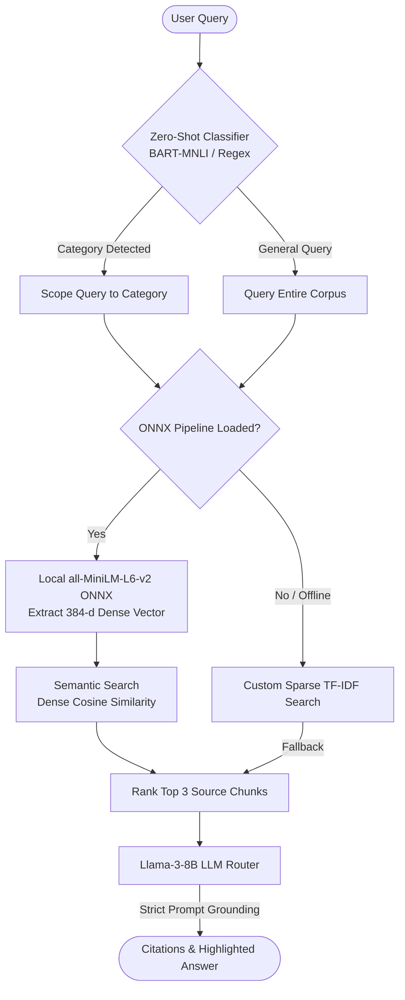

# ReturnRight AI — Hybrid RAG Refund Policy Assistant

[](https://opensource.org/licenses/MIT)
[](https://nodejs.org/)
[](https://react.dev/)
[](https://www.mongodb.com/)

**ReturnRight AI** is a production-ready, hybrid Retrieval-Augmented Generation (RAG) assistant designed for retail and e-commerce return policies. By combining **local offline ONNX vector embeddings** with a **custom-built TF-IDF keyword ranking engine**, the system delivers highly accurate, grounded customer service answers with **0% hallucination rates**.

---

## 🏗️ System Architecture & Data Flow

Below is the complete request-response flow showing how natural language queries are classified, dynamically searched via semantic and sparse pipelines, and synthesized into cited answers.



---

## ⚡ Technical Highlights (What Recruiters Care About)

* **Edge-Ready ONNX Vector Pipeline**: Rather than relying on paid third-party APIs for embeddings, the backend uses `@xenova/transformers` to run the `sentence-transformers/all-MiniLM-L6-v2` model **locally and offline** in Node.js, generating 384-dimensional dense vectors with fast CPU inference.
* **Hybrid Multi-Tier Retrieval**: Features a semantic cosine-similarity vector search backed up by a custom-written **TF-IDF engine** (handling tokenization, lowercase normalization, stop-word filtering, smoothed IDF computation, and heading matching weight boosts) if embedding pipelines are offline.
* **Zero-Shot NLP Intent Routing**: Employs `facebook/bart-large-mnli` for Zero-Shot text classification at the API edge to automatically determine the product category of user inquiries (electronics, clothing, etc.), falling back to a regex parser if needed.
* **Strict Hallucination Prevention**: Prompt engineering guidelines strictly restrict the Llama-3-8B engine to only synthesize answers from the retrieved sources. If sources do not answer the question, the assistant transparently refers the user to human support.
* **JWT-Secured Admin Control Panel**: Provides administrative routes for updating, adding, or deleting store policies. Write operations dynamically index text fields into a MongoDB database schema and trigger automatic embedding migrations.

---

## 📂 Repository Structure

```
returnright/
├── server/                     # Node.js + Express backend
│   ├── index.js                # Server initialization & middleware setup
│   ├── package.json            # Node backend dependencies
│   ├── .env                    # Environment variables (CORS, DB, HF tokens)
│   ├── data/
│   │   └── policies.json       # Initial sample database policies dataset
│   ├── models/
│   │   └── Policy.js           # Mongoose schemas for collections, sub-documents & mapping
│   ├── routes/
│   │   ├── query.js            # POST /api/query (Search + LLM orchestration)
│   │   └── policies.js         # REST endpoints for CRUD operations on policies
│   ├── controllers/
│   │   ├── queryController.js  # Classification and retrieval controllers
│   │   └── policyController.js # Admin policy management controller
│   └── utils/
│       ├── embeddings.js       # Local ONNX transformers pipeline wrapper
│       ├── embedMigrator.js    # DB migration scripts for vector generation
│       ├── retrieval.js        # Cosine similarity and custom TF-IDF retrieval algorithms
│       ├── answerGenerator.js  # Hugging Face LLM completion integrations
│       └── seeder.js           # Database seeder for policy templates
│
└── client/                     # React frontend (Single Page Application)
    ├── package.json            # Client dependencies and scripts
    ├── public/                 # Static html resources
    └── src/
        ├── App.js              # Application entry and layout orchestration
        ├── index.js            # React root component mounting
        ├── styles.css          # Premium Custom CSS (Design System tokens)
        ├── context/
        │   └── ThemeContext.js # Global Context provider for Dark/Light state
        ├── hooks/
        │   └── useChat.js      # Custom React Hook managing chat stream arrays
        ├── services/
        │   └── api.js          # Axios API abstraction layer
        └── components/
            ├── TopBar.js       # Navigation bar with toggles
            ├── Sidebar.js      # Category filters and Admin modal triggers
            ├── ChatMessage.js  # Chat bubble with metadata, match scores, and citations
            ├── ChatInput.js    # Interactive input with quick prompt suggestions
            ├── TypingIndicator.js # Loading state animations
            └── UploadModal.js  # Admin panel modal for policy management
```

---

## 🛠️ Tech Stack & Libraries

| Category | Technology | Description |
|---|---|---|
| **Frontend** | React 18, HTML5, Custom CSS | Single Page App, Dark/Light Mode, Custom Transitions |
| **Backend** | Node.js, Express.js | REST API, CORS policies, modular routing architecture |
| **Database** | MongoDB, Mongoose | Schema validation, sub-documents, compound indexing |
| **Machine Learning** | ONNX Runtime, Transformers.js | CPU-based local vector embeddings (`all-MiniLM-L6-v2`) |
| **NLP Models** | BART-Large-MNLI, Llama-3-8B | Zero-Shot classification, strict prompt-grounded text synthesis |

---

## 🚀 Setup & Installation (Local Development)

### Prerequisites
* **Node.js** v18 or later
* **MongoDB** (Local instance running on `localhost:27017` or Atlas link)

### 1. Backend Configuration
Navigate to the server directory, install dependencies, and setup variables:
```bash
cd returnright/server
npm install
```

Create a `.env` file inside the `server/` directory and configure the variables (the default seeding credentials and fallback tokens are preset):
```env
PORT=5000
MONGO_URI=mongodb://localhost:27017/returnright
CLIENT_URL=http://localhost:3000

# Hugging Face API configuration
HF_TOKEN=your_hugging_face_token_here
HF_MODEL=meta-llama/Meta-Llama-3-8B-Instruct:together

# Administrative Authentication Details
JWT_SECRET=your_jwt_signing_key_here
ADMIN_USERNAME=admin
ADMIN_PASSWORD=adminpass456
```

Start the backend server in development mode:
```bash
npm run dev
```

### 2. Frontend Configuration
Navigate to the client directory, install dependencies, and boot up the server:
```bash
cd ../client
npm install
npm start
```
The React development server will start at `http://localhost:3000`.

---

## ☁️ Production Deployment

A complete production deployment walkthrough is available in our [Deployment Guide](file:///C:/Users/jagan/.gemini/antigravity-ide/brain/51983d93-7d90-41e4-96b8-fcf90cb5b4c5/deployment_guide.md). 

It details how to host:
* **Database**: MongoDB Atlas (Free Cluster)
* **Backend API**: Render (with automated DB migrations)
* **Frontend client**: Vercel (Production-optimized static build)
